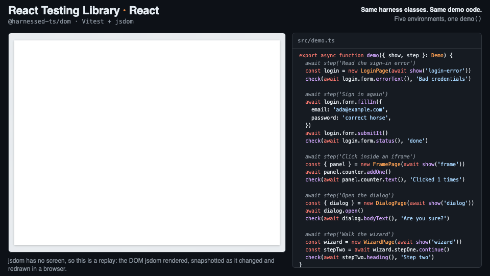
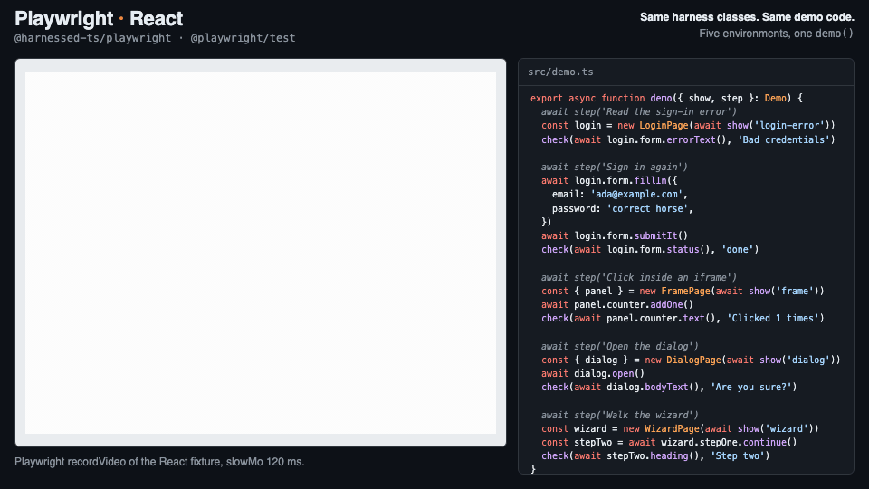
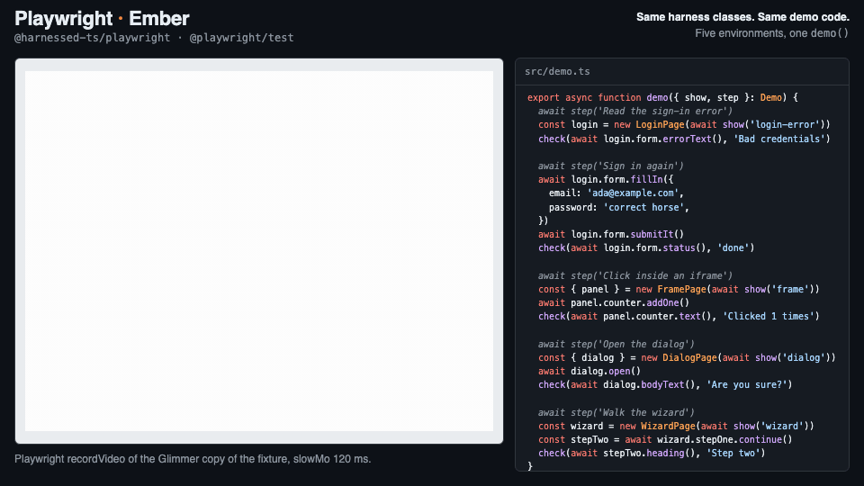
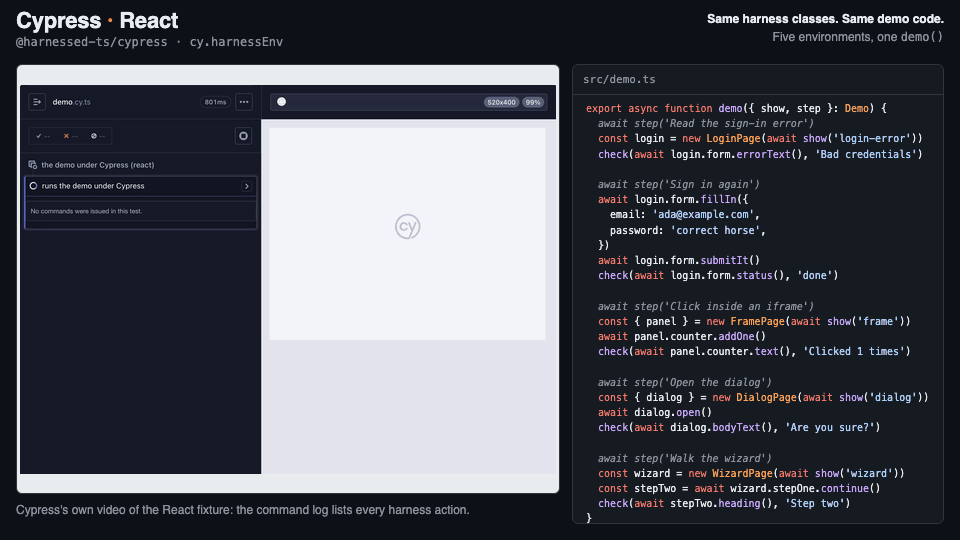
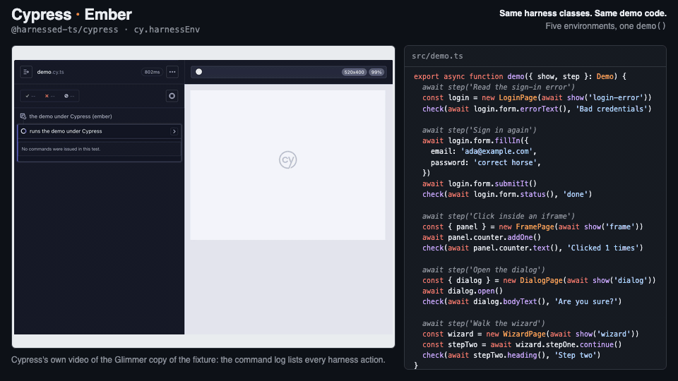

# harnessed

One page-object API that runs under every major JavaScript test runner: Testing
Library, Playwright, Ember, Cypress, WebdriverIO, Vitest browser mode, Puppeteer
and TestCafe, with Gherkin on top.

A **harness** is a class that lets a test drive a component the way a person would,
through methods named for what the component _does_. Tests state intent; the
harness owns the DOM wiring. Write the harness once and it works in a fast jsdom
unit test and in a real browser.

```ts
@Harness({ host: testId('login-form') })
class LoginFormHarness extends ComponentHarness {
  @ByLabel('Email') private accessor email!: Query
  @ByLabel('Password') private accessor password!: Query
  @ByRole('button', { name: /sign in/i }) private accessor submit!: Query
  @ByTestId('login-error') private accessor errorLine!: Query

  async signInAs(email: string, password: string): Promise<void> {
    await this.email.fill(email)
    await this.password.fill(password)
    await this.submit.click()
  }

  async error(): Promise<string | null> {
    if (await this.errorLine.isAbsent()) return null
    return this.errorLine.text()
  }
}
```

```ts
// jsdom, via Testing Library
render(<LoginForm />)
const form = new LoginFormHarness(dom({ user: userEvent.setup() }))
await form.signInAs('ada@example.com', 'hunter2')
expect(await form.error()).toBeNull()

// a real browser, via Playwright — the same harness class
const form = new LoginFormHarness(pw(page))
await form.signInAs('ada@example.com', 'hunter2')
await expect(form).toBeAbsent()
```

Inspired by [Angular CDK Component Harnesses][cdk],
[ember-test-fixture][etf], and [Playwright Page Object Models][pom].

[cdk]: https://angular.dev/guide/testing/component-harnesses-overview
[etf]: https://github.com/jayseo5953/ember-test-fixture
[pom]: https://playwright.dev/docs/pom

## Why

- Tests stop knowing about DOM structure, CSS classes, and internal state.
- Tests read as a list of things the component can do.
- One harness serves every level of the pyramid — no second set of selectors for
  the browser suite that drifts out of step with the first.

## Support matrix

| Runner                                                 | Package          | Component harnesses    | Pages and `goto()`        | Assertions              | Gherkin                                            | Frames                           | Conformance in CI  |
| ------------------------------------------------------ | ---------------- | ---------------------- | ------------------------- | ----------------------- | -------------------------------------------------- | -------------------------------- | ------------------ |
| [Testing Library](#using-with-testing-library) (jsdom) | `dom`            | ✓                      | constructs; no navigation | `expect` matchers       | —                                                  | same-origin                      | ✓                  |
| [Playwright](#using-with-playwright)                   | `playwright`     | ✓                      | ✓                         | `expect` matchers       | [playwright-bdd, cucumber-js](#using-with-gherkin) | cross-origin                     | ✓ React and Ember  |
| [Ember](#using-with-ember): ember-qunit, ember-exam    | `ember`          | ✓ rendering tests      | ✓ application tests       | `assert.harness`        | [ember-cli-yadda](#ember-cli-yadda)                | same-origin                      | ✓                  |
| [Ember](#using-with-ember): Vitest browser             | `ember`          | ✓                      | ✓ application tests       | Chai                    | —                                                  | same-origin                      | ✓                  |
| [Cypress](#using-with-cypress) e2e                     | `cypress`        | ✓ through `cy.harness` | ✓ `cy.visitPage`          | Chai                    | [Cypress cucumber](#cypress-cucumber)              | same-origin                      | ✓ React and Ember  |
| [Cypress](#using-with-cypress) component               | `cypress`        | ✓ through `cy.harness` | constructs; no navigation | Chai                    | —                                                  | same-origin                      | ✓                  |
| [WebdriverIO](#using-with-webdriverio)                 | `webdriverio`    | ✓                      | ✓                         | `expect` matchers, Chai | —                                                  | cross-origin                     | ✓ BiDi and Classic |
| [Vitest browser mode](#using-with-vitest-browser-mode) | `vitest-browser` | ✓                      | constructs; no navigation | `expect` matchers       | —                                                  | same-origin, Playwright provider | ✓                  |
| [Puppeteer](#using-with-puppeteer)                     | `puppeteer`      | ✓                      | ✓                         | `expect` matchers       | —                                                  | cross-origin                     | ✓                  |
| [TestCafe](#using-with-testcafe)                       | `testcafe`       | ✓                      | ✓                         | `t.expect`, Chai        | —                                                  | same-origin                      | ✓                  |

Every package is `@harnessed-ts/<name>`. "Conformance" means the shared catalog in
`packages/conformance` runs, unchanged, under that runner on every pull request —
see [Cross-driver guarantees](#cross-driver-guarantees). Playwright and Cypress e2e
run it twice: against the React fixture, and against its Ember port, built by
Vite and served as an app in a real browser. "Constructs; no
navigation": a page builds and reads under that runner, but `goto()` and the URL
members are refused, since there is no address bar (`urlFor()` still works).
`HarnessedWorld`, the cucumber-js adapter, takes any env; CI runs it with
Playwright.

### UI frameworks

A harness queries the DOM, not a framework, so nothing in one is tied to React
or Ember. What earns a ✓ here is a fixture written in that framework and a
conformance run against it.

| Framework                   | Status      | Covered by                                                                                                                                                                                                                                                                                                                                         |
| --------------------------- | ----------- | -------------------------------------------------------------------------------------------------------------------------------------------------------------------------------------------------------------------------------------------------------------------------------------------------------------------------------------------------- |
| React                       | ✓           | The conformance fixture, `packages/conformance/fixture`, is a React app. Every runner above except Ember's drives it.                                                                                                                                                                                                                              |
| Ember                       | ✓           | A Glimmer copy of that fixture in `test-apps/ember-vite` and `test-apps/ember-classic`, held to the React fixture's markup by a fixture-parity test. ember-qunit, ember-exam and Vitest browser run the catalog against it, and Playwright and Cypress e2e run it against the built app (`test-apps/playwright-ember`, `test-apps/cypress-ember`). |
| Vue, Svelte, Angular, Solid | coming soon | Harnesses are framework-agnostic, but these have no fixture or conformance run yet.                                                                                                                                                                                                                                                                |

## See it run

One demo flow, [`test-apps/demos/src/demo.ts`](test-apps/demos/src/demo.ts),
written once against the conformance fixture's harnesses and pages, run under
five environments. Every recording drives the same harness classes with the same
`demo()` function, shown beside the footage with the running step lit.

**React Testing Library · React** — `@harnessed-ts/dom` under Vitest. jsdom has
no screen, so this one is a replay of the DOM jsdom rendered, snapshotted as it
changed and redrawn in a browser.



**Playwright · React** — `@harnessed-ts/playwright`, recorded with Playwright's
`recordVideo`.



**Playwright · Ember** — the same run against the Glimmer copy of the fixture.



**Cypress · React** — `@harnessed-ts/cypress` inside `cy.harnessEnv`, from
Cypress's own video. The command log lists each harness action.



**Cypress · Ember** — the same run against the Glimmer copy of the fixture.



To regenerate the GIFs, run `pnpm --filter test-app-demos record`. It needs:

- `ffmpeg` and `ffprobe` on `PATH`;
- Playwright's Chromium: `pnpm --filter test-app-demos exec playwright install chromium`;
- the Cypress binary: `pnpm --filter test-app-demos exec cypress install`;
- the packages built: `pnpm build` at the repo root.

CI runs the same demo under all five environments, without recording, so the
demo keeps passing against the harnesses it shows. `record` also writes the hash
of the `demo.ts` it recorded to `docs/media/demo.sha256`, and CI fails when
`demo.ts` no longer matches it, so the code beside the footage is the code in
the repo. A change to a harness or the fixture that leaves `demo.ts` alone still
passes; re-record then if it changes what the footage shows.

## Install

```bash
npm i -D @harnessed-ts/core

# plus the driver(s) you use
npm i -D @harnessed-ts/dom             # Testing Library / jsdom
npm i -D @harnessed-ts/playwright      # Playwright
npm i -D @harnessed-ts/ember           # Ember: ember-qunit, ember-exam, Vitest
npm i -D @harnessed-ts/cypress         # Cypress: e2e and component tests
npm i -D @harnessed-ts/webdriverio     # WebdriverIO 10
npm i -D @harnessed-ts/vitest-browser  # Vitest browser mode
npm i -D @harnessed-ts/puppeteer       # Puppeteer
npm i -D @harnessed-ts/testcafe        # TestCafe
npm i -D @harnessed-ts/page            # page objects: screens composed of harnesses
npm i -D @harnessed-ts/gherkin         # Gherkin: world, page registry, {page}

# plus the assertion style your runner uses, if it is not `expect.extend`-based
npm i -D @harnessed-ts/qunit        # assert.harness(x) — ember-qunit, QUnit
npm i -D @harnessed-ts/chai         # expect(x).to.be.absent — Mocha, Cypress
```

`@harnessed-ts/core` depends on no driver. A jsdom-only project never resolves
Playwright, and a Cypress project never resolves Puppeteer. Each runner's section
below lists exactly what it needs.

### Required setup

Standard decorators and `accessor` fields are the authoring surface, and they need
two things.

**1. Three compiler options.** Extend the shipped config to get them:

```jsonc
// tsconfig.json
{
  "extends": "@harnessed-ts/core/tsconfig.json",
  // → target: ES2022, useDefineForClassFields: true, lib includes ESNext.Decorators
}
```

**2. A transform that lowers them.** No JavaScript runtime can parse `accessor`
yet, and Vite's default transform passes it through untouched. Add the plugin
first in the list:

```ts
import { harnessedDecorators } from '@harnessed-ts/core/vite'

export default defineConfig({
  plugins: [harnessedDecorators(), react()],
})
```

Both your Vite config and your Vitest config need it. Playwright's own transform
handles decorators already, so its config does not.

> Omitting either step fails at runtime, not at typecheck: every decorated field
> becomes a syntax error or silently loses its getter.

**Ember, and any app compiled by Babel with legacy decorators.** Your app's
`@tracked`, `@service` and `@action` only work with the legacy transform, so it
cannot switch wholesale. `@harnessed-ts/core/babel` claims harness files only —
`*.harness.*` and `*.page.*` files, and anything under a `harness/` or
`harnesses/` directory, matched against the path relative to the Babel root —
and compiles them with the standard transform before the app's own decorator
plugins see them. Everything else is left alone. List it first:

```js
// babel.config.cjs — Embroider + Vite (the Ember 6+ blueprint)
module.exports = {
  plugins: [
    require.resolve('@harnessed-ts/core/babel'),
    // …the blueprint's plugins, decorator-transforms among them
  ],
}

// ember-cli-build.js — classic builds
const app = new EmberApp(defaults, {
  babel: { plugins: [require.resolve('@harnessed-ts/core/babel')] },
})
```

```bash
npm i -D @babel/plugin-proposal-decorators @babel/plugin-transform-typescript @babel/plugin-transform-class-static-block
```

Babel 7.24 or later. If your harnesses live elsewhere, or your app's own
legacy-decorated files happen to use one of those names, pass
`[require.resolve('@harnessed-ts/core/babel'), { include: ['tests/pages/'] }]` —
strings match as substrings of the root-relative path; RegExps work too.

Type-checking needs the same split: an Ember `tsconfig.json` sets
`experimentalDecorators`, under which `accessor` fields cannot be decorated. Give
the harness directory a project of its own and reference it from the app's, then
check with `ember-tsc --build` (or `tsc --build`):

```jsonc
// tests/harness/tsconfig.json
{
  "extends": "@harnessed-ts/core/tsconfig.json",
  "compilerOptions": { "composite": true, "emitDeclarationOnly": true, "outDir": "../../tmp/harness-types" },
  "include": ["**/*.ts"],
}

// tsconfig.json — the app's
{ "exclude": ["tests/harness"], "references": [{ "path": "./tests/harness" }] }
```

## Cross-driver guarantees

Every item below is backed by a spec in `packages/conformance` that runs, unchanged,
under each driver. A driver that disagrees with another fails the build — that
agreement is the whole reason the abstraction exists.

1. **Absence answers immediately.** `count()` and `isAbsent()` on something that is
   not on screen return straight away. They never wait out a timeout and never
   throw.
2. **Single-target operations are strict.** More than one match is a
   `StrictModeViolation` naming the selector, raised at once — never a silent pick
   of the first. That holds for questions and waits too: `isVisible()`,
   `waitForVisible()` and `waitForHidden()` on duplicates reject with the same
   violation rather than answering `false` or waiting out the timeout. It is core's
   class, in the same wording, under every driver — those that resolve inside a
   remote page included — so `instanceof StrictModeViolation` tells ambiguity
   apart from absence. An `nth()` past the last match is not ambiguous: there
   `isVisible()` answers `false` and `waitForHidden()` resolves, as for an absent
   target.
3. **`role` selectors honour `level`.** `@ByRole('heading', { level: 1 })` picks the
   `h1` on a screen that also has an `h2`.
4. **`elementBy()` keeps the harness's scope.** A selector computed at call time is
   still scoped to the host, so a matching node elsewhere on the page is not found.
5. **`{ global: true }` escapes the scope, and only it does.** A portalled dialog is
   reachable from a global field and invisible to a scoped one.
6. **A page composes under its own scope.** A component harness or a page nested
   in a page with `@ChildHarness` inherits the page's scope chain, so a matching
   node elsewhere on the screen is not found.
7. **Readiness is one check, phrased one way.** `expectReady()` resolves once the
   page's `waitForReady()` does, and otherwise rejects naming the page —
   `<Page> did not become ready.` with the original failure as `cause`, or
   `<Page> did not become ready within <n>ms.` when an explicit `{ timeout }`
   elapsed first. `isReady()` answers `false` and never throws.
8. **Transitions hand back a ready page.** `transitionTo(NextPage)` constructs the
   next page in the same scope and awaits its readiness before returning it.
9. **A page constructs under every driver.** Only `goto()` and the URL members
   need a driver that can navigate; under one that cannot they fail at call time
   with `the "<driver>" driver cannot navigate`. `goto()` on a page with no `path`
   fails with `<Page> declares no path` before touching the driver. `urlFor()`
   resolves the URL `goto()` would visit under any driver, navigating or not.
10. **A frame is a scope boundary, crossed only by `frame()`.** A harness nested
    through a frame reads and drives the frame's document; a scoped query outside
    it never sees in; `{ global: true }` inside it stays in the frame's document;
    a frame marker on anything but an `<iframe>` rejects; and a page nested in a
    frame refuses its URL members with `<Page> is nested in a frame`. The dom
    driver enters same-origin frames only, and names the frame when it cannot.

Where the drivers genuinely cannot match, the difference is documented rather than
papered over:

- **`isVisible()`** is a layout check — a non-empty box that `visibility` does not
  hide, inside frames that are visible too — under every driver except the dom
  driver. jsdom computes no layout, so there it is a computed-style check, and a
  node with no box reads as visible. Assert on absence or on state, not on
  visibility, when you want the same answer from jsdom and a browser.
- **Frames** are same-origin only under the dom driver, Ember, Cypress, TestCafe
  and Vitest browser mode, which resolve inside the page and cannot read a
  cross-origin document. Playwright, Puppeteer and WebdriverIO enter frames from
  outside the page, so cross-origin frames work there.
- **`currentUrl`** is synchronous, so under WebdriverIO and TestCafe, which read the
  page asynchronously, it is the URL as of the driver's last call. After an
  in-app navigation, `await page.assertPathname(...)`, which polls, before reading
  it.
- **Navigation** needs an address bar: under the dom driver, Vitest browser mode,
  Cypress component tests and Ember rendering tests a page constructs and reads,
  but `goto()` and the URL members are refused.
- **`check()` / `uncheck()`** need a real checkbox or radio under Playwright. For a
  non-native control, read `aria-checked` — which every driver prefers when present.

## API

### Selectors

`testId('x')`, `role('button', { name: /save/i, level: 2 })`, `label('Email')`,
`text(/expired/)`, `placeholder('you@example.com')`. Each returns a `Selector`, a
plain data description of a query.

`frame(selector)` marks an `<iframe>`. Used as a host, the harness's `self` is the
iframe element and its fields resolve inside the frame's document:

```ts
@Harness({ host: frame(testId('payment-frame')) })
class PaymentFrame extends ComponentHarness {
  @ByRole('button', { name: 'Pay' }) private accessor pay!: Query
}
```

To reuse a harness written for the framed app itself, pass the iframe to
`@ChildHarness` instead — the child is unchanged:

```ts
@ChildHarness(CheckoutPage, { frame: testId('checkout-frame') }) accessor checkout!: CheckoutPage
```

Playwright enters cross-origin frames as well. The dom driver can only enter
same-origin ones; jsdom cannot load another origin's document.

### `Query`

A query descriptor — a scope chain plus a selector — not a resolved node. Nothing
is looked up until a method is called, which is why a field can be declared before
its component has rendered.

| Group        | Members                                                                                |
| ------------ | -------------------------------------------------------------------------------------- |
| Interactions | `click` `fill` `clear` `check` `uncheck` `selectOption` `hover` `focus` `blur` `press` |
| Observations | `text` `inputValue` `attribute` `isVisible` `isEnabled` `isChecked` `selectedOptions`  |
| Waiting      | `waitForVisible` `waitForHidden`                                                       |
| Lists        | `count` `isAbsent` `nth` `first` `last` `each` `map` `filter` `texts`                  |

Every method takes an optional `{ timeout }`. `waitForVisible()` resolves once
the target is on screen and visible; `waitForHidden()` once it is hidden or gone —
absent counts as hidden. Both reject at once on a target that matches more than
one node (guarantee 2), and otherwise when the timeout runs out.

### `ComponentHarness`

`@Harness({ host })` declares the root element. Element fields are
`private accessor` and use `@ByRole` / `@ByTestId` / `@ByLabel` / `@ByText` /
`@ByPlaceholder`, scoped to the host. `@ChildHarness(Cls)` nests a harness and
passes the scope chain down; `@ChildHarness(Cls, { frame: testId('…') })` nests it
inside an iframe.

- `self` — the host element. Right when the host _is_ the control.
- `count` / `isAbsent` / `nth` / `first` / `last` / `each` / `map` / `filter` — for a
  component rendered several times on one screen.
- `elementBy(selector)` — a selector computed at call time, still scoped.
- `childHarness(Cls, { frame })` — the method form of `@ChildHarness`.

An **abstract** base may carry fields and methods with no host of its own; each
subclass supplies one. Resolution walks the prototype chain and the nearest
`@Harness` wins, so a subclass can also override a base's host.

### `PageHarness` (`@harnessed-ts/page`)

One test object per screen: what it is composed of, how to know it has arrived,
and — when it has a URL — how to get there. A page nests component harnesses and
other pages with `@ChildHarness`, and tests enter through it.

```ts
@Harness({ host: testId('page-checkout') })
class CheckoutPage extends PageHarness<{ token: string }> {
  override get path() {
    return '/checkout?token=$token'
  }

  @ChildHarness(CartHarness) accessor cart!: CartHarness

  protected async waitForReady(): Promise<void> {
    await this.self.waitForVisible()
  }

  async placeOrder(): Promise<ConfirmationPage> {
    await this.cart.checkout()
    return this.transitionTo(ConfirmationPage)
  }
}

// a real browser
const checkout = new CheckoutPage(pw(page))
await checkout.goto({ token })
const confirmation = await checkout.placeOrder()

// jsdom — the test renders the app, then waits for the page
render(<App />)
const rendered = new CheckoutPage(dom({ user: userEvent.setup() }))
await rendered.expectReady()
```

A page constructs under **every** driver: navigation is resolved lazily, so only
`goto()` and the URL members need a driver that can drive an address bar, and
under one that cannot (jsdom has no URL) they fail at call time with one readable
error.

`path` is optional. A page reached by URL overrides `get path()`; the type
parameter declares its params, so `goto()` is checked against the path rather
than trusted. Substitution is textual, so it works in the query string as well as
the path, at **every** occurrence, URL-encoded. A page reached by interaction
leaves `path` out, and `goto()` on it is a refusal, not a silent no-op.

`waitForReady()` runs behind `goto()` and `expectReady()` and must never be empty —
an empty one satisfies the abstract member and silently removes the wait, so the
failure lands somewhere unrelated later in the test. The usual body is one line
against the page's own host: `await this.self.waitForVisible()`. With no
`{ timeout }` the wait is bounded only by what `waitForReady()` itself waits on;
an explicit one adds a second clock. `isReady()` is the non-throwing probe; pass
a short `{ timeout }`.

`transitionTo(NextPage)` is how an action returns the page it leads to: it
constructs `NextPage` with the same env and scope and awaits its readiness. A
shared app shell — nav, header, toasts — is an **abstract** page base carrying
those fields (`abstract class AppPage extends PageHarness`); each concrete page
extends it and supplies its own host.

Also provides `currentUrl`, `currentPathname`, `currentSearchParams`, and
`assertPathname()` — which waits, and compares the **pathname**, so it keeps
matching once the URL carries a query string. `urlFor(params)` returns the URL
`goto()` would visit without visiting it, for a runner that queues its own
navigation (Cypress's `cy.visit`).

`RouteHarness` in `@harnessed-ts/route` is the old name for this class. It is a
deprecated re-export for one release.

### Matchers

```ts
import '@harnessed-ts/dom/matchers' // or '@harnessed-ts/playwright/matchers'

await expect(card).toBeSelected()
await expect(banner).toBeAbsent()
await expect(price).toReadAs(/^\$/)
```

They take a target or a harness. `toReadAs` rather than `toHaveText` because
Playwright already ships a `toHaveText` for Locators.

The same three checks, with the same failure messages, in the two other
assertion styles a runner is likely to use. All of them are async — await them.

```ts
// QUnit (ember-qunit): call install(QUnit) once, from tests/test-helper
import { install } from '@harnessed-ts/qunit'
install(QUnit)

await assert.harness(card).isSelected() // .isNotSelected()
await assert.harness(banner).isAbsent() // .isPresent()
await assert.harness(price).readsAs(/^\$/) // .doesNotReadAs()

// Chai (Mocha, Cypress, WebdriverIO under Mocha)
import { harnessedChai } from '@harnessed-ts/chai'
chai.use(harnessedChai)

await expect(card).to.be.selected
await expect(banner).to.be.absent // .not.to.be.absent
await expect(price).to.readAs(/^\$/)
```

A failure under QUnit or Chai also reports what was read beside what was wanted,
so their reporters show both.

### Configuration

```ts
// harnessed.config.ts
import { defineConfig } from '@harnessed-ts/core'

export default defineConfig({
  testIdAttribute: 'data-testid',
  defaultTimeout: 5000,
  layout: { components: 'src/components', pages: 'src/pages', harnesses: 'harness' },
  testIdPattern: { widget: 'ui-<kebab>', page: 'page-<kebab>' },
})
```

One place to declare these, read by everything that needs them.
`@harnessed-ts/eslint-plugin` and `@harnessed-ts/claude` load the file themselves — the
linter resolves it by walking up from the file being checked, so a monorepo and an
editor started anywhere both find the right one. `testIdAttribute` is pushed into
Testing Library and Playwright for you.

The runtime half is explicit, because your test setup already transforms
TypeScript and a bundler-free loader has no business running there:

```ts
// vitest setup file
import { applyConfig } from '@harnessed-ts/core'
import config from '../harnessed.config'

applyConfig(config)
```

## Using with Testing Library

```bash
npm i -D @harnessed-ts/core @harnessed-ts/dom @testing-library/dom @testing-library/user-event
```

Render with your framework's Testing Library, then build the env from a
user-event instance. Interactions go through user-event, queries through the
shared resolver:

```tsx
import { dom } from '@harnessed-ts/dom'
import '@harnessed-ts/dom/matchers' // toBeAbsent, toBeSelected, toReadAs
import userEvent from '@testing-library/user-event'

const { baseElement } = render(<LoginForm />)
const form = new LoginFormHarness(dom({ user: userEvent.setup(), container: baseElement }))
await form.signInAs('ada@example.com', 'hunter2')
expect(await form.error()).toBeNull()
```

`container` scopes queries to one render; the default is `document.body`, where
portals land. Add `harnessedDecorators()` to the Vitest config (see
[Required setup](#required-setup)). The matchers extend Vitest's `expect`; under
Jest, `expect.extend(harnessMatchers)` from `@harnessed-ts/core`.

jsdom has no layout and no address bar, so:

- **`isVisible()`** is a computed-style check (see
  [Cross-driver guarantees](#cross-driver-guarantees)).
- **Pages construct, but do not navigate.** Render the app, then
  `await page.expectReady()`; `goto()` and the URL members are refused.
- **Frames** are entered when they are same-origin.

## Using with Playwright

```bash
npm i -D @harnessed-ts/core @harnessed-ts/playwright
```

Build the env from the test's `page`. Playwright's own transform compiles
decorators, so there is nothing to add to its config:

```ts
import { pw } from '@harnessed-ts/playwright'
import '@harnessed-ts/playwright/matchers' // toBeAbsent, toBeSelected, toReadAs
import { expect, test } from '@playwright/test'

test('checks out', async ({ page }) => {
  const checkout = new CheckoutPage(pw(page))
  await checkout.goto({ token: 'abc' }) // resolved against the config's baseURL
  const confirmation = await checkout.placeOrder()
  await expect(confirmation.heading).toReadAs('Thanks!')
})
```

Queries become Locators, so waiting and strictness are Playwright's own, and
frames — cross-origin included — are entered with `frameLocator()`.
`isVisible()` is Playwright's layout check, and answers at once. For a Gherkin
suite, see [Using with Gherkin](#using-with-gherkin); for a backend-free suite,
[`createApiStubs`](#extras-in-harnessed-tsplaywright).

## Using with Ember

```bash
npm i -D @harnessed-ts/core @harnessed-ts/ember @harnessed-ts/qunit
npm i -D @testing-library/dom @testing-library/user-event
npm i -D @babel/plugin-proposal-decorators @babel/plugin-transform-typescript @babel/plugin-transform-class-static-block
```

Add `@harnessed-ts/core/babel` to the app's Babel config (see
[Required setup](#required-setup)), then build envs with `ember()`. Queries
resolve through the shared resolver. Clicks and fills go through
`@ember/test-helpers`; keys, hover, focus and selects through user-event, as in
the Testing Library driver. Every interaction returns once the app has settled.

```ts
// tests/test-helper.ts
import { install } from '@harnessed-ts/qunit'
install(QUnit)

// a rendering test
await render(<template><LoginForm /></template>)
const form = new LoginFormHarness(ember())
await form.signInAs('ada@example.com', 'hunter2')
await assert.harness(form.error).isAbsent()

// an application test: goto() drives the router
const checkout = new CheckoutPage(ember())
await checkout.goto({ token })
```

| Runner              | How                                                                                                                                                                                                                                                                                                                            |
| ------------------- | ------------------------------------------------------------------------------------------------------------------------------------------------------------------------------------------------------------------------------------------------------------------------------------------------------------------------------ |
| ember-qunit         | as above; `assert.harness(x)` from `@harnessed-ts/qunit`                                                                                                                                                                                                                                                                       |
| ember-exam          | use ember-exam's `start` in `test-helper` as usual; harnesses keep no state between tests                                                                                                                                                                                                                                      |
| Vitest browser mode | [`ember-vitest`](https://github.com/NullVoxPopuli/ember-vitest)'s `renderingTest` / `applicationTest`, describe/it, and `chai.use(harnessedChai)` from `@harnessed-ts/chai`. An app built with Embroider needs two Vitest workarounds — see [`test-apps/ember-vite/vitest.config.mts`](test-apps/ember-vite/vitest.config.mts) |
| ember-mocha         | not supported: its last release depends on `@ember/test-helpers` 1.x. For BDD-style Ember tests, use Vitest browser mode as above                                                                                                                                                                                              |

Classic and Embroider + Vite builds, Ember 5.12 and later.

Where Ember differs from the other drivers:

- **Queries start at the test's root element** (`#ember-testing`), for scoped and
  `{ global: true }` fields alike — not `document.body`, which also holds QUnit's
  report. Render portals (`{{in-element}}`, modal containers) inside it, or pass
  `ember({ root })`.
- **`isVisible()` is a layout check**, as in a browser driver: the tests run in a
  real browser.
- **The URL members need a router.** `goto()` works in application tests; in a
  rendering test, and before an application test's first visit, `currentUrl` and
  `assertPathname()` refuse at once rather than reading as `/`.

## Using with Cypress

```bash
npm i -D @harnessed-ts/core @harnessed-ts/cypress @harnessed-ts/chai \
  @testing-library/dom @testing-library/user-event
```

Register the commands and the Chai assertions in your support file
(`cypress/support/e2e.ts`, or `component.ts` for component tests):

```ts
import '@harnessed-ts/cypress/support'
import { harnessedChai } from '@harnessed-ts/chai'

chai.use(harnessedChai) // Cypress bundles Chai; this adds absent, selected, readAs
```

Cypress commands are enqueued, not awaited, and a promise cannot enqueue one. So a
harness runs inside a single command, as ordinary promises against the
application under test:

```ts
it('signs in', () => {
  cy.visitPage(LoginPage) // cy.visit(page.urlFor()), then waits for expectReady()
  cy.harness(LoginFormHarness, async form => {
    await form.fillIn({ email: 'ada@example.com', password: 'hopper' })
    await form.submitIt()
    await expect(form).to.readAs(/Welcome/)
  })
})
```

- `cy.harness(Cls, fn?, options?)` constructs the harness and awaits `fn`,
  yielding what it resolves to; without `fn` it yields the harness. When `fn`
  resolves nothing, the previous subject passes through, as with `cy.then` —
  `undefined` at the start of a chain.
  `cy.harnessEnv(env => …)` hands you the env to build several at once. Each
  harness action is written to the command log.
- `options.timeout` covers the whole callback. It defaults to four times
  `defaultTimeout`, since one flow is several waits in a row.
- Inside the callback, use `await` and harness methods only — never `cy.*`.
- `cy.visitPage(Page, params?)` is the Cypress-native way in. In e2e tests,
  `page.goto()` also works inside the callback, resolving a relative URL against
  `baseUrl` (or, without one, the page the AUT is on). In component tests it
  refuses, because the spec frame is the page.
- Component tests: `cy.mount(<LoginForm />)`, then `cy.harness(LoginFormHarness, …)`.
  Mount with `cypress/react`. If you compile your own harnesses, add
  `harnessedDecorators()` from `@harnessed-ts/core/vite` to the dev server's Vite
  config.

**Differences under Cypress:**

- **Interactions** are `@testing-library/user-event` events by default:
  synthetic, with `isTrusted` false, in every browser.
- **Trusted input.** Pass `{ realEvents: true }` to get real browser input through
  the Chrome DevTools Protocol. This covers click, hover, fill, clear, check and
  press. It needs a Chromium-family browser (Chrome, Edge or Electron) and is
  refused by name elsewhere. As under Playwright, `fill` sets a date, time,
  datetime-local, month, week, color or range input's value directly and fires
  `input` and `change`, since those take no typing.
- **`selectOption` under `realEvents`** still goes through user-event, because
  CDP input cannot operate a native `<select>` popup.
- **`press` under `realEvents`** takes single characters and the named keys
  (Enter, Tab, arrows and so on), not chords.
- **`isVisible()`** uses the shared layout rule, as under Playwright: a
  non-empty box that `visibility` does not hide, with a `display: contents`
  node judged by what it contains, and content inside a hidden frame hidden.
  An `opacity: 0` node counts as visible.
- **Frames** are entered when they are same-origin only, as under the dom
  driver.

## Using with WebdriverIO

```bash
npm i -D @harnessed-ts/core @harnessed-ts/webdriverio   # WebdriverIO 10
```

Build the env from the testrunner's `browser` and hand it to any harness or
page. Register the matchers once, from a spec or the config's `before` hook:

```ts
import { wdio } from '@harnessed-ts/webdriverio'
import '@harnessed-ts/webdriverio/matchers' // toBeAbsent, toBeSelected, toReadAs
import { browser, expect } from '@wdio/globals'

it('signs in', async () => {
  const login = new LoginPage(wdio(browser))
  await login.goto() // browser.url(), resolved against baseUrl
  await login.form.fillIn({ email: 'ada@example.com', password: 'hopper' })
  await expect(login.form.errorQuery).toBeAbsent()
})
```

On a harness or a query, `toBeSelected` is harnessed's (`aria-pressed`); on a
WebdriverIO element it is still expect-webdriverio's own (`isSelected`).

Under Mocha you can assert in Chai's style instead: `chai.use(harnessedChai)`
from `@harnessed-ts/chai`, then `await expect(banner).to.be.absent`.

The shared resolver is injected into each document on first use (under BiDi it
is also registered as a preload script, so later documents start with it), and
`testIdAttribute` travels with every call. Differences from the other drivers:

- **Frames** are entered through WebDriver — a frame's own browsing context under
  BiDi, `switchFrame` under Classic, switched back afterwards — so cross-origin
  frames work. An error raised inside a frame names the scope chain from that
  frame inward.
- **`isVisible()`** is WebDriver's `isDisplayed()`, a layout check, applied to the
  target and to every iframe on the way to it. Like Playwright's, it answers at
  once rather than waiting for the target.
- **`currentUrl`** is the top-level URL as of the driver's last round-trip:
  `goto()`, `assertPathname()`, or any query. After an in-app navigation,
  `await page.assertPathname(...)` before reading it.
- **`fill()` and `clear()`** select the existing value and delete it by keyboard,
  so a controlled input sees the edit. Date, time, colour and range inputs are set
  directly, as WebdriverIO does.
- **`press()`** takes Playwright's key names and `+` chords (`'Shift+Tab'`,
  `'ControlOrMeta+a'`). Bindings are the platform's: `Control+a` does not select
  all on macOS.
- **Waits** run inside the page, so a `timeout` above the session's script
  timeout (30s by default) needs `browser.setTimeout({ script })`.

## Using with Vitest browser mode

```bash
npm i -D @harnessed-ts/core @harnessed-ts/vitest-browser @testing-library/dom
npm i -D @vitest/browser-playwright vitest-browser-react   # or your provider and renderer
```

The test runs in the browser beside your components, so harnesses resolve in the
page with the same resolver as the dom driver, and act through the provider's
`userEvent`: Playwright's click, fill and select, with real events.

```ts
// vitest.config.ts
export default defineConfig({
  plugins: [harnessedDecorators(), react()],
  test: {
    browser: { enabled: true, provider: playwright(), instances: [{ browser: 'chromium' }] },
  },
})
```

```tsx
import { vitestBrowser } from '@harnessed-ts/vitest-browser'
import '@harnessed-ts/vitest-browser/matchers'
import { render } from 'vitest-browser-react'

await render(<LoginForm />)
const form = new LoginFormHarness(vitestBrowser())
await form.signInAs('ada@example.com', 'hunter2')
expect(await form.error()).toBeNull()
```

`vitestBrowser({ container })` scopes queries to one tree; the default,
`document.body`, is where portals land.

Differences from the dom driver:

- **`isVisible()`** is Playwright's layout check: a non-empty box that `visibility`
  does not hide. `opacity: 0` reads as visible here and hidden under jsdom.
- **Actions wait for actionability**, as Playwright's do: clicking a disabled or
  hidden element waits, then fails, rather than acting at once.
- **Frames need the Playwright provider.** A framed element is reached through
  `page.frameLocator()`, which only that provider implements.
- **No navigation.** This is component testing, like the dom driver: a page's
  `goto()` and URL members are refused; `urlFor()` still works.
- The driver adds one locator method, `harnessedSelector`, through
  `locators.extend`, to chain into frames. It is not meant for tests.

## Using with Puppeteer

```bash
npm i -D @harnessed-ts/core @harnessed-ts/puppeteer puppeteer
```

Puppeteer has no test runner, so pick one — Vitest or Jest. Under Vitest, add
`harnessedDecorators()` to the Vitest config (see [Required setup](#required-setup))
and register the matchers from a setup file:

```ts
// vitest.setup.ts
import '@harnessed-ts/puppeteer/matchers'
// Jest: import { harnessMatchers } from '@harnessed-ts/core'; expect.extend(harnessMatchers)
```

Build the env from a Puppeteer `Page`. `baseURL` is what a page's relative `path`
resolves against in `goto()` — Puppeteer, unlike Playwright, has none of its own:

```ts
import { puppeteer } from '@harnessed-ts/puppeteer'
import { launch } from 'puppeteer'

const browser = await launch()
const page = await browser.newPage()
const env = puppeteer(page, { baseURL: 'http://localhost:3000' })

const login = new LoginPage(env)
await login.goto()
await login.form.fillIn({ email: 'ada@example.com' })
await expect(login.form.errorQuery).toBeAbsent()
```

The driver injects `@harnessed-ts/resolve` into each document it queries, so
roles, labels and strictness resolve exactly as they do under the dom driver, and
acts through `ElementHandle`s, so clicks and keys are real browser input.

Differences worth knowing:

- **Frames, cross-origin included.** Each `frame()` link is resolved in the
  document around it and entered with `contentFrame()`, so the driver reaches
  frames that no in-page resolver can.
- **`isVisible()` uses real layout**, by the same rule as Playwright's: a node
  with an empty box, `visibility: hidden`, or inside a hidden frame reads as
  hidden, and a `display: contents` node is as visible as what it contains. Like
  the dom driver, it waits for the target first; ask `isAbsent()` when you mean
  "not on screen".
- **`fill()` replaces** the value, as Playwright's does: it selects what is there
  and inserts the new text as one input event, and `fill('')` clears. It waits,
  within the timeout, for the target to be editable and focused, and rejects a
  disabled or readonly target rather than typing into whatever had focus.
- **Navigation mid-lookup** is retried in the next document until the timeout,
  so a query that spans a full-page load waits for it.
- **`press()`** takes Playwright's key names and chords (`Shift+ArrowLeft`).
- **`selectOption()`** matches an option's value, then its label, and replaces a
  multi-select's selection.

## Using with TestCafe

```bash
npm i -D @harnessed-ts/core @harnessed-ts/testcafe testcafe typescript
```

Build the env from the test's controller — the `t` the test function is
handed, not the `t` exported by `'testcafe'`, which belongs to no one test and
is refused. There is nothing else to wire: the driver installs the shared
resolver in each page the first time a harness touches it.

```ts
import { testcafe } from '@harnessed-ts/testcafe'

fixture('checkout').page('http://localhost:3000/cart')

test('applies a coupon', async t => {
  const cart = new CartPage(testcafe(t, { baseUrl: 'http://localhost:3000' }))
  await cart.coupon.apply('SAVE10')
  await t.expect(await cart.total.text()).eql('$90.00')
  await t.expect(await cart.coupon.errorText()).eql(null)
})
```

TestCafe compiles your `.ts` files itself, with a bundled TypeScript 4.9 that
predates standard decorators and pins `target` to ES2016. Point it at your own
TypeScript (5.0 or later) and turn legacy decorators off, so harnesses compile
the way they do everywhere else:

```js
// .testcaferc.cjs
module.exports = {
  compilerOptions: {
    typescript: {
      customCompilerModulePath: require.resolve('typescript'),
      options: { experimentalDecorators: false, emitDecoratorMetadata: false },
      // TypeScript 6 also needs: ignoreDeprecations: '6.0'
    },
  },
}
```

Assert with `t.expect` on awaited values, or with `@harnessed-ts/chai`; there
is no `/matchers` entry. Documented differences:

- **Frames** are entered from the page's own document, as under the dom driver:
  same-origin only. An action inside a frame switches TestCafe into each iframe
  and always back to the main window, so do not hold a manual
  `t.switchToIframe()` across a harness call.
- **`currentUrl`** is synchronous and TestCafe reads the page asynchronously, so
  it reports the URL as of the last harness call, action or `goto()` — not a
  navigation the page made on its own since. `assertPathname()` polls and is
  always current.
- **`goto()`** resolves a relative path against `baseUrl` when the env has one,
  and otherwise against the page the test is on.
- **`selectOption()`** sets the selection and dispatches `input` and `change`,
  as Playwright does, rather than clicking through a native dropdown.
- **`fill()` and `clear()`** refuse what TestCafe's `typeText` would get
  silently wrong: an element that is not an `<input>`, `<textarea>` or
  `[contenteditable]` (rather than typing into whatever it contains), an
  `<input>` that takes no text, such as a checkbox (as Playwright's `fill()`
  does), and, once the timeout runs out, a disabled, `aria-disabled` or
  readonly control.
- **`press()`** takes Playwright's key names and chords. TestCafe has no
  function or numpad keys, so `press('F5')` throws before anything is sent.
  `ControlOrMeta` follows the browser's `navigator.platform`, not the test
  runner's.
- **`isVisible()`** uses the shared layout rule: a non-empty box that
  `visibility` does not hide, and content inside a hidden frame is hidden.

## Using with Gherkin

```bash
npm i -D @harnessed-ts/gherkin
```

`@harnessed-ts/gherkin` gives Gherkin steps three things, with an adapter per
runner:

- **A world**: a scenario-scoped bag for the pages a scenario builds up. Steps
  are separate functions, so the obvious place for a harness is a module-level
  `let`, which leaks into the next scenario as soon as the runner reuses a
  worker. Each adapter gives the bag a scenario's lifetime.
- **A page registry**: `definePages({ checkout: CheckoutPage })` names the pages a
  feature can open, and `pages.open(name, env)` constructs one, typed.
- **A `{page}` parameter type**: `pageParameter(pages)` matches only registered
  names, so a feature that names an unknown page fails at step matching, where
  the typo is.

Step bodies stay hand-written: the feature's wording is the team's, not a mirror
of method names. The registry and parameter type are the same under every
runner:

```ts
import { definePages, pageParameter } from '@harnessed-ts/gherkin'

export const pages = definePages({ checkout: CheckoutPage })
defineParameterType(pageParameter(pages)) // the runner's own defineParameterType
```

### playwright-bdd

`withWorld` adds a `world` fixture to playwright-bdd's `test`. A fixture is
per-scenario, so it cannot leak:

```ts
import { withWorld } from '@harnessed-ts/gherkin/playwright-bdd'
import { pw } from '@harnessed-ts/playwright'
import { expect } from '@playwright/test'
import { createBdd, test as base } from 'playwright-bdd'
import { pages } from './pages'

export const test = withWorld<{ checkout: CheckoutPage }, typeof base>(base)
const { When, Then } = createBdd(test)

When('I open the {page} page', async ({ page, world }, name: 'checkout') => {
  world.checkout = pages.open(name, pw(page))
  await world.checkout.goto()
})
Then('the total is {string}', async ({ world }, total: string) => {
  expect(await world.checkout!.total()).toBe(total)
})
```

`@harnessed-ts/playwright/bdd` still re-exports `withWorld`, deprecated for one
release.

### cucumber-js

cucumber-js builds a new world object per scenario, so `HarnessedWorld` keeps
the bag on it. Assign the registry in a subclass and set `env` in a `Before`;
`this.open(name)` builds a page with it:

```ts
import { Before, setWorldConstructor, Then, When } from '@cucumber/cucumber'
import { definePages } from '@harnessed-ts/gherkin'
import { HarnessedWorld } from '@harnessed-ts/gherkin/cucumber'
import { pw } from '@harnessed-ts/playwright'

const pageMap = { checkout: CheckoutPage }
class AppWorld extends HarnessedWorld<{ checkout: CheckoutPage }, typeof pageMap> {
  override pages = definePages(pageMap)
}
setWorldConstructor(AppWorld)

// `browser`: a Playwright browser launched in a BeforeAll.
Before(async function (this: AppWorld) {
  this.env = pw(await browser.newPage()) // or wdio(browser), puppeteer(page), …
})
When('I open the {page} page', async function (this: AppWorld, name: 'checkout') {
  this.bag.checkout = this.open(name)
  await this.bag.checkout.goto()
})
```

### Cypress cucumber

```bash
npm i -D @harnessed-ts/gherkin @harnessed-ts/cypress @badeball/cypress-cucumber-preprocessor
```

Set up the preprocessor as its docs describe, and import
`@harnessed-ts/cypress/support` in the support file. `cypressWorld()` resets the
world before each scenario; steps read it through `world()`, and run harnesses
inside the bridge, since steps are Cypress commands:

```ts
import { defineParameterType, Then, When } from '@badeball/cypress-cucumber-preprocessor'
import { definePages, pageParameter } from '@harnessed-ts/gherkin'
import { cypressWorld } from '@harnessed-ts/gherkin/cypress'

const pages = definePages({ checkout: CheckoutPage })
defineParameterType(pageParameter(pages))
const { world } = cypressWorld<{ checkout: CheckoutPage }>()

When('I open the {page} page', (name: 'checkout') => {
  cy.harnessEnv(async env => {
    const page = pages.open(name, env)
    await page.goto()
    world().checkout = page
  })
})
Then('the total is {string}', (total: string) => {
  cy.harnessEnv(() => world().checkout!.total()).should('eq', total)
})
```

Call `cypressWorld()` once, at the top level of a step definitions file, and
share `world`; never keep pages in a module-level `let`.

### ember-cli-yadda

```bash
npm i -D @harnessed-ts/gherkin @harnessed-ts/ember ember-cli-yadda yadda
```

ember-cli-yadda compiles `tests/acceptance/<name>.feature` into a test that calls
the default export of `tests/acceptance/steps/<name>-steps` once per scenario, so
`yaddaWorld().steps()` there gives each scenario a fresh world. Steps take the
scenario first, and `$page` matches only a registered page:

```ts
import { ember } from '@harnessed-ts/ember'
import { definePages } from '@harnessed-ts/gherkin'
import { yaddaWorld } from '@harnessed-ts/gherkin/yadda'

const pages = definePages({ checkout: CheckoutPage })
const checkout = yaddaWorld<{ checkout: CheckoutPage }>()

export default function (assert: Assert) {
  const steps = checkout.steps({ pages, env: () => ember() })
  steps
    .when('I open the $page page', async ({ world, open }, name: 'checkout') => {
      world.checkout = open(name)
      await world.checkout.goto()
    })
    .then('the total is "$total"', async ({ world }, total: string) => {
      assert.strictEqual(await world.checkout?.total(), total)
    })
  return steps.library
}
```

To add `$page` to a dictionary that defines other terms, pass it in:
`steps({ pages, env, dictionary: pageDictionary(pages, { dictionary }) })`. Adding
the term to the same dictionary again returns it unchanged, so a module-level
dictionary is safe inside the per-scenario default export.

Make the feature an application test (`@setupapplicationtest`, or a default in
`tests/helpers/yadda-annotations`) so `goto()` drives the router. ember-cli-yadda
0.7 predates Ember 6: override its `ember-cli-htmlbars` to `^7`, and since Yadda 3
imports `node:fs`, strip the `node:` scheme for Yadda's modules in
ember-auto-import's webpack config — `test-apps/ember-classic/ember-cli-build.js`
shows both.

## Keeping the conventions

**`@harnessed-ts/eslint-plugin`** turns the authoring rules into a gate:

```js
import harnessed from '@harnessed-ts/eslint-plugin'
export default [harnessed.configs.recommended]
```

| Rule                           | Catches                                                                                                                                                                                                                                                                                                                                                                                                                                                  |
| ------------------------------ | -------------------------------------------------------------------------------------------------------------------------------------------------------------------------------------------------------------------------------------------------------------------------------------------------------------------------------------------------------------------------------------------------------------------------------------------------------- |
| `no-page-or-screen-in-harness` | a harness reaching for the driver's own query API — `this.page`, a bare `page`'s queries (Puppeteer's `page.$`, Vitest browser's `page.getByRole`), `screen`, `cy.get`, Ember's `find`, WebdriverIO's `$`, TestCafe's `Selector` — which drops the scope chain and leaks the coupling it exists to contain. Exempts a page's `waitForReady()`.                                                                                                           |
| `require-host`                 | a concrete harness or page with no `@Harness({ host })` — otherwise a runtime throw in whichever test ran first                                                                                                                                                                                                                                                                                                                                          |
| `require-wait-for-ready`       | a page with a missing or empty `waitForReady()`                                                                                                                                                                                                                                                                                                                                                                                                          |
| `no-reach-through-cast`        | `(harness as unknown as { page }).page`                                                                                                                                                                                                                                                                                                                                                                                                                  |
| `no-raw-locator-in-test`       | a raw query in a test that should go through a harness — `page.getByRole(…)`, `screen.getByText(…)`, Puppeteer's `page.$(…)`, `cy.get(…)`, Ember's `find(…)` or `click('.selector')`, `this.element.querySelector(…)`, WebdriverIO's `$(…)`, TestCafe's `Selector(…)` (a warning in `recommended`, an error in `strict`). Bare function names (`find`, `$`, `Selector`) are matched by import source, so lodash's `find` or jQuery's `$` are left alone. |
| `no-component-harness-in-test` | a test constructing a component harness directly instead of entering through a page. Runtime-agnostic (`testFiles` globs); exempts a file that renders the component itself. `strict` only.                                                                                                                                                                                                                                                              |

**`@harnessed-ts/claude`** installs the authoring conventions for coding agents:

```bash
npm i -D @harnessed-ts/claude && npx @harnessed-ts/claude install
```

It writes `.claude/skills/harness/` and `.claude/rules/harness.md`, generating the
file-placement table from your repo's actual layout, and creates
`harnessed.config.ts` if it is missing. It also detects the test runners the repo
uses — Ember, Cypress, WebdriverIO, TestCafe, Puppeteer, Playwright, Vitest
browser mode, Testing Library, Gherkin — from the dependencies and config files of
the root and every workspace package, and documents only those: how a test builds
the env and asserts, with a worked example per runner (per adapter, for Gherkin).
Pass `--runners cypress,gherkin` to choose them yourself. Re-running refreshes the
docs, removes the examples of runners the repo no longer uses, and leaves your
config alone.

## Packages

| Package                        | What                                                                                                                                                 |
| ------------------------------ | ---------------------------------------------------------------------------------------------------------------------------------------------------- |
| `@harnessed-ts/core`           | `Query`, `Selector`, `ComponentHarness`, the decorators, the driver registry, `configure()`, the Vite plugin, matcher implementations                |
| `@harnessed-ts/dom`            | Testing Library driver + matchers. No React dependency                                                                                               |
| `@harnessed-ts/resolve`        | the shared selector resolver, plus an injectable build for remote drivers. A driver author's dependency                                              |
| `@harnessed-ts/playwright`     | Playwright driver + matchers, `createApiStubs`, and the deprecated `withWorld`                                                                       |
| `@harnessed-ts/ember`          | Ember driver over `@ember/test-helpers`: rendering and application tests                                                                             |
| `@harnessed-ts/vitest-browser` | Vitest browser mode driver + matchers: in-page resolution, provider-native events                                                                    |
| `@harnessed-ts/puppeteer`      | Puppeteer driver + matchers over the injected resolver; cross-origin frames                                                                          |
| `@harnessed-ts/webdriverio`    | WebdriverIO driver + matchers over the injected resolver; BiDi and Classic, cross-origin frames                                                      |
| `@harnessed-ts/cypress`        | Cypress driver: the `cy.harness` bridge and `cy.visitPage`, e2e and component testing                                                                |
| `@harnessed-ts/testcafe`       | TestCafe driver over the injected resolver                                                                                                           |
| `@harnessed-ts/gherkin`        | Gherkin: a scenario-scoped world, a typed page registry and `{page}`; adapters for playwright-bdd, cucumber-js, Cypress cucumber and ember-cli-yadda |
| `@harnessed-ts/qunit`          | `assert.harness(x)` checks for QUnit and ember-qunit                                                                                                 |
| `@harnessed-ts/chai`           | `expect(x).to.be.absent` and friends for Chai: Mocha, Cypress, WebdriverIO                                                                           |
| `@harnessed-ts/page`           | `PageHarness`                                                                                                                                        |
| `@harnessed-ts/route`          | deprecated: re-exports `PageHarness` as `RouteHarness` for one release                                                                               |
| `@harnessed-ts/eslint-plugin`  | the six rules above                                                                                                                                  |
| `@harnessed-ts/claude`         | authoring skill, rules, templates, and the install CLI                                                                                               |

### Extras in `@harnessed-ts/playwright`

**`createApiStubs`** fulfils API requests from an in-memory object, so a browser
suite runs with no backend and no database — with a flag to send everything to the
real one instead. A green stubbed run is not a promise that the real endpoints
work; keep a separate check against a deployed environment.

**`withWorld`** (from `@harnessed-ts/playwright/bdd`) is deprecated: it moved to
`@harnessed-ts/gherkin/playwright-bdd` — see [Using with Gherkin](#using-with-gherkin).

## Adding a driver

`@harnessed-ts/core` holds a registry keyed by driver id and never imports a driver.
A driver supplies an env, 20 `Query` members, and a registration:

```ts
registerDriver('my-driver', (env, scope, selector) => new MyQuery(env, scope, selector))
```

Everything list-shaped — `nth`, `first`, `last`, `each`, `map`, `filter`, `texts`,
`isAbsent` — is inherited. Override `all()` if resolving a whole list at once is
cheaper for you than resolving each element (it is, for Testing Library; it is not
for Playwright, whose locators are descriptors). The registry lives on `globalThis`
under a `Symbol.for` key, so a graph that loads both the ESM and the CJS build
still has one registry.

Resolving selectors is the part most likely to drift. If your driver can run
JavaScript in the page, use [`@harnessed-ts/resolve`](packages/resolve/README.md)
rather than writing your own: it is what the Testing Library driver uses, so role,
label, strictness and frame semantics come out identical. A driver that resolves
from Node injects its self-contained build (`@harnessed-ts/resolve/inject`), and
passes what the page throws through core's `reviveStrictViolation()`: a class
does not survive the trip back, and that restores `StrictModeViolation`.

If your driver can navigate, register that too and a page's `goto()` works
against it unchanged:

```ts
registerNavigation('my-driver', { goto, currentUrl, waitForUrl })
```

**A driver is done when it passes the conformance suite**, which is published for
exactly this purpose:

```bash
npm i -D @harnessed-ts/conformance
```

See [`@harnessed-ts/conformance`](packages/conformance/README.md) — one set of specs,
run by every driver, so a harness written against one works against yours.

## Requirements

Node ≥ 22.12 (≥ 22.19 for `@harnessed-ts/webdriverio`, WebdriverIO 10's own floor)
and TypeScript ≥ 5.2. Published as ESM and CJS. Each driver's runner is a peer
dependency, with these floors:

| Package                        | Peer floor                                                                                                        |
| ------------------------------ | ----------------------------------------------------------------------------------------------------------------- |
| `@harnessed-ts/dom`            | `@testing-library/dom` ≥ 10, `@testing-library/user-event` ≥ 14                                                   |
| `@harnessed-ts/playwright`     | `@playwright/test` ≥ 1.43                                                                                         |
| `@harnessed-ts/ember`          | `@ember/test-helpers` ≥ 5 (Ember 5.12 and later), `@testing-library/dom` ≥ 10, `@testing-library/user-event` ≥ 14 |
| `@harnessed-ts/cypress`        | `cypress` ≥ 13, `@testing-library/dom` ≥ 10, `@testing-library/user-event` ≥ 14                                   |
| `@harnessed-ts/webdriverio`    | `webdriverio` ≥ 10                                                                                                |
| `@harnessed-ts/vitest-browser` | `vitest` ≥ 4, `@testing-library/dom` ≥ 10                                                                         |
| `@harnessed-ts/puppeteer`      | `puppeteer` ≥ 24                                                                                                  |
| `@harnessed-ts/testcafe`       | `testcafe` ≥ 3                                                                                                    |
| `@harnessed-ts/gherkin`        | the adapter's runner: `@cucumber/cucumber` ≥ 10, `yadda` ≥ 3, …                                                   |
| `@harnessed-ts/core/babel`     | Babel ≥ 7.24 < 8, with the decorator and TypeScript plugins                                                       |
| `@harnessed-ts/qunit`, `chai`  | `qunit` ≥ 2.19, `chai` ≥ 4                                                                                        |

## Contributing

See [CONTRIBUTING.md](CONTRIBUTING.md). The gate is conformance parity: both
drivers run the same specs and must agree.

## License

MIT © Joe Gaudet, Jay Seo
